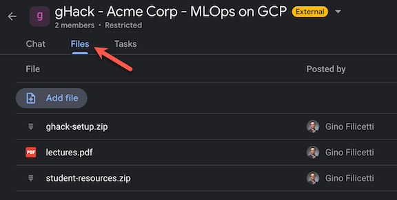

# gHacks - How to Setup Your Environment

Before we can get started hacking, we need to set up our environment using a script provided by your gHack to provision all the needed resources.

This document has the following sections:
- [Project](#confirm-your-project-is-ready)
- [Cloud Shell](#start-the-cloud-shell)
- [Student Files](#upload-and-unzip-all-student-files)
- [Provision Resources](#run-terraform-to-provision-needed-resources)

> **Note** If you're using an Argolis environment, there are some default org policies that will need to be changed to allow traffic through to the load balancer. Run the `argolis-fix-policy-defaults.sh` script in [this repository](https://github.com/gfilicetti/gcp-scripts) to set all the proper defaults.

## Confirm Your Project Is Ready
Sign-in to the [Google Cloud Console](http://console.cloud.google.com/) and select the project that was assigned to you. Alternately, if you have permissions, you can create a new project for this hack.

## Start the Cloud Shell
Although you can use the Google Cloud command line interface locally on your machine, in this gHack you will be using the Google Cloud Shell instead to make it easier.

- From the GCP Console click the Cloud Shell icon on the top right toolbar:

    

- It should only take a few moments to provision and connect to the environment. When it is finished, you should see something like this:

    

- This virtual machine is loaded with all the development tools you'll need. It offers a persistent 5GB home directory, and runs on Google Cloud, greatly enhancing network performance and authentication. All of your work in this gHack can be done completely in the browser.

## Upload and Unzip All Student Files
You've been given a set of files that you will need through-out this gHack. We need to copy them into the right places.

- In the Google Space for this gHack Event, go to the **Files** tab and download **ALL** available files to your computer. 
	> **Note** Your hack may not come with all of these files, that's ok.

	

- Now go to the Cloud Shell, click the 3 vertical dots and select **Upload**.

	

- If `student-files.zip` exists for your gHack you need to:
	- Upload it to the Cloud Shell
	- Run this command in the Cloud Shell to unzip it:
		```bash
		unzip student-files.zip -d ~/student-files
		```

- If `ghack-setup.zip` exists for your gHack you need to:
	- Upload it to the Cloud Shell
	- Run this command in the Cloud Shell to unzip it:
		```bash
		unzip ghack-setup.zip -d ~/ghack-setup
		```

- Leave the unzipped student files where they are, we will be using them in various challenges throughout this gHack.

## Run Terraform to Provision Needed Resources
There are some resources that need to be created before starting our hack. We have consolidated these into a Terraform script that provisions everything for us. Each gHack will need to do something different in its script to get the environment ready, some examples are:

- Enabling the Google Cloud services we'll be using.
- Creating a net new VPC Network.
- Adding IAM permissions
- Creating Service Accounts

We need to run these commands to invoke the Terraform script and provision all of our pre-requisites:

```bash
cd ~/ghack-setup
terraform init
terraform apply --auto-approve --var gcp_project_id=${GOOGLE_CLOUD_PROJECT} --var gcp_region=us-central1 --var gcp_zone=us-central1-a
```

You should see output similar to this:


## Success Criteria

- You have a project for your hacking
- You've confirmed that Cloud Shell is working for you
- You've uploaded and unzip student resources if they were provided
- You've run the Terraform script to install all needed pre-requisites

## Learning Resources
- [Creating and Managing Projects](https://cloud.google.com/resource-manager/docs/creating-managing-projects#before_you_begin)
- [VIDEO: Running Terraform in Cloud Shell](https://youtu.be/flNnefErtL0)
- [Terraform Documentation](https://developer.hashicorp.com/terraform/docs)